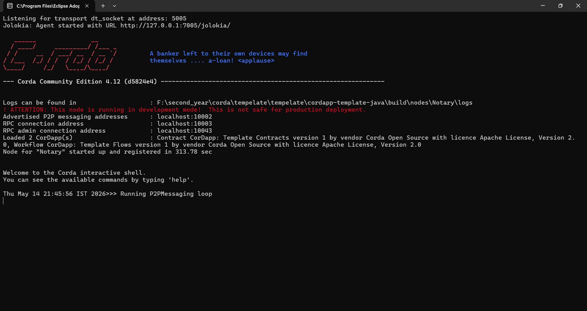
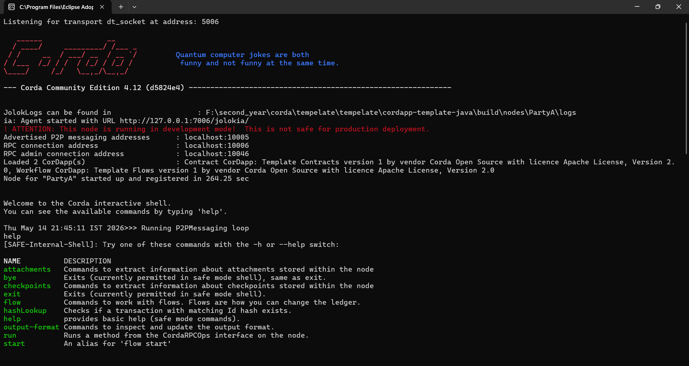
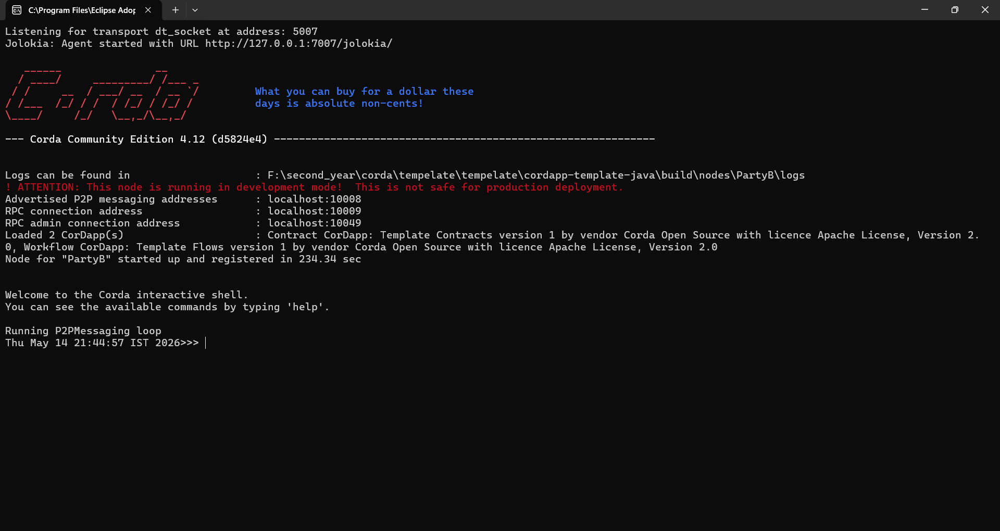

# Student Management CorDapp

Blockchain-based Student Management CorDapp developed using Corda 4.12 for storing and verifying student records securely on a distributed ledger.

---

# Developer

## Pradnya Naresh Ghodke

### LinkedIn Profile
[Pradnya Ghodke](https://www.linkedin.com/in/pradnya-ghodke/)

---

# Project Description

This project is a simple blockchain-based Student Management System built using Corda.  
The CorDapp allows users to:

- Create student records
- Store records on blockchain ledger
- Verify transactions using smart contracts
- Execute blockchain flows
- Query stored data from Corda vault

---

# Technologies & Tools Used

| Technology | Purpose |
|---|---|
| Java | Backend programming |
| Corda 4.12 | Blockchain platform |
| Gradle | Build automation |
| IntelliJ IDEA | Development IDE |
| PowerShell | Running commands |
| GitHub | Project hosting |
| RPC Flows | Blockchain transaction execution |

---

# Software Used

- IntelliJ IDEA
- Java JDK 17
- Corda Community Edition 4.12
- Gradle
- GitHub

---

# Project Structure

```text
StudentContract.java
StudentState.java
StudentFlow.java
StudentResponder.java
build.gradle
settings.gradle
README.md
```

---

# Core Components

## 1. StudentState

Stores:
- Student ID
- Student Name
- Marks
- Owner information

---

## 2. StudentContract

Validates blockchain transaction rules:

- Student ID must not be empty
- Marks must be greater than or equal to 0
- Owner must sign transaction

---

## 3. StudentFlow

Responsible for:
- Creating blockchain transactions
- Sending data to ledger
- Finalizing transaction

---

## 4. StudentResponder

Receives finalized transaction from initiating node.

---

# Flow Command Used

```bash
flow start StudentFlow studentId: "101", name: "pradnya", marks: 95
```

---

# Vault Query Command

```bash
run vaultQuery contractStateType: com.template.states.StudentState
```

---

# Project Output Screenshots

## Notary Node



---

## Party A Node



---

## Party B Node



---

# Features

- Distributed Ledger Storage
- Smart Contract Validation
- Blockchain Transaction Flow
- Vault Query Support
- Multi-node Corda Network

---

# Learning Outcomes

Through this project I learned:

- Corda blockchain architecture
- CorDapp development
- Smart contracts
- States and flows
- Node deployment
- Vault queries
- Gradle build system
- GitHub project management

---

# Author

## Pradnya Naresh Ghodke

Blockchain Technology Student  
Savitribai Phule Pune University

LinkedIn:
https://www.linkedin.com/in/pradnya-ghodke/

---
